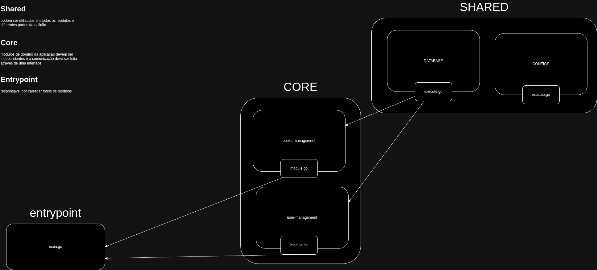

# Sobre

Uma aplicação web construída com Go, que implementa uma arquitetura monolítica modular, promovendo uma estrutura de código limpa e de fácil manutenção.

## Descrição

Este projeto demonstra a aplicação dos conceitos de uma arquitetura monolítica modular, onde as diferentes funcionalidades são organizadas em módulos distintos. A separação de responsabilidades facilita a manutenção, a escalabilidade e a legibilidade do código.

## Diagrama da arquitetura



## Estrutura do Projeto

```
├── cmd
│   └── app
│       └── main.go
├── docker-compose.yml
├── docs
│   └── images
│       └── diagrama_modulos.drawio.png
├── example.env
├── go.mod
├── go.sum
├── internal
│   ├── core
│   │   ├── books-management
│   │   └── user-management
│   │       ├── domain
│   │       │   └── user.go
│   │       ├── features
│   │       │   ├── create
│   │       │   │   ├── data
│   │       │   │   │   └── repository.go
│   │       │   │   ├── http
│   │       │   │   │   ├── handler.go
│   │       │   │   │   └── routes.go
│   │       │   │   ├── use_case
│   │       │   │   │   └── services.go
│   │       │   │   └── web
│   │       │   │       └── views
│   │       │   │           ├── error.html
│   │       │   │           ├── register.html
│   │       │   │           └── success.html
│   │       │   ├── delete
│   │       │   ├── find_all
│   │       │   │   ├── data
│   │       │   │   │   └── repository.go
│   │       │   │   ├── http
│   │       │   │   │   ├── handler.go
│   │       │   │   │   └── routes.go
│   │       │   │   ├── use_case
│   │       │   │   │   └── services.go
│   │       │   │   └── web
│   │       │   │       └── views
│   │       │   │           └── list.html
│   │       │   └── update
│   │       ├── module.go
│   │       └── sql
│   │           └── init.sql
│   └── shared
│       ├── config
│       │   └── env_vars
│       │       ├── load_database_vars
│       │       │   └── execute.go
│       │       └── load_server_vars
│       │           └── execute.go
│       ├── database
│       │   ├── configure_database
│       │   │   └── execute.go
│       │   └── module.go
│       └── http
│           ├── adapters
│           │   ├── gin_context.go
│           │   └── gin_router.go
│           └── interfaces
│               ├── context.go
│               └── router.go
└── readme.md
```
## Explicação
- **cmd/**: Contém o código de entrada da aplicação; o arquivo **main.go** é o ponto de partida da execução.

- **docker-compose.yml**: Configura e orquestra serviços para a aplicação em contêineres Docker.

- **internal/**: Lógica central da aplicação organizada em módulos.
  - **core/**: Módulos principais da lógica de domínio.
    - **books-management/**: Gestão de livros.
    - **user-management/**: Gestão de usuários.
      - **domain/**: Modelos e lógica de domínio de usuários.
      - **features/**: Implementações de funcionalidades do módulo.
        - **create/**: Funcionalidade para criar registros.
        - **delete/**: Funcionalidade para deletar registros.
        - **find_all/**: Funcionalidade para buscar todos os registros.
        - **update/**: Funcionalidade para atualizar registros.
      - **module.go**: Carrega e configura o módulo de usuários.
      - **sql/**: Scripts SQL para inicialização do banco de dados.

- **shared/**: Módulos utilizados em toda a aplicação.
  - **config/**: Carrega variáveis de ambiente para configuração.
  - **database/**: Configuração e inicialização do banco de dados.
